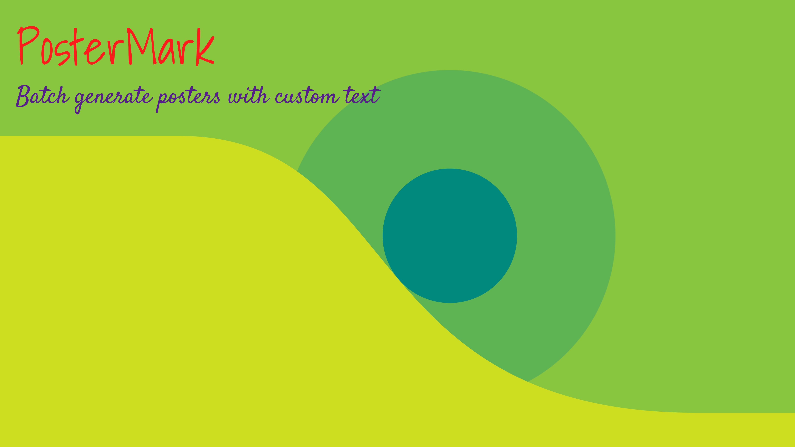

<h1 align="center"> PosterMark </h1>

## Description

Batch generate posters with custom text

Useful to generate Youtube playlist thumbnails



## Folder Structure

```
assets  
│
└─── fonts
│       Satisfy.ttf
│       ShadowIntoLight.ttf
│
└─── images
        poster.png
```

Place your TrueTypeFonts in the fonts directory and background images in the images directory

## Settings

Update *settings.json* to customize the output

```
{
    "OutputPath": "out",
	"ImagesPath": "./assets/images/",
	"BackgroundImage": "poster.png",
	"FontsPath": "./assets/fonts/",
	"Title": {
		"Font": "ShadowsIntoLight.ttf",
		"Size": 300,
		"Color": "(254, 27, 28)",
		"Position": "(100, 50)"
	},
	"Subtitle": {
		"Font": "Satisfy.ttf",
		"Size": 150,
		"Color": "(85, 30, 138)",
		"Position": "(100, 500)"
	}
}
```

You can also change the background image, title and subtitle fonts

The *color* is represented by (R, G, B) values and *position* by (X, Y)

The fonts used here are [Satisfy](https://fonts.google.com/specimen/Satisfy) and [ShadowsIntoLight](https://fonts.google.com/specimen/Shadows+Into+Light) from Google fonts

## Posters

Update *fileList.json* to specify the titles and subtitles for the posters

```
{
  "Sample": {
    "Title": "PosterMark",
    "Subtitle": "Batch generate posters with custom text"
  }
}
```
Key of the each json object will be the file name of the poster. Here in the above example, the file name will be *Sample.png*

## Usage 

Install [Python3](https://www.python.org/downloads/)

Clone this repository

Create a virtual environment(venv) in the cloned repository directory and activate the venv
```
python3 -m venv .\venv
```

Install pip packages
```
pip install -r .\requirements.txt
```

Update *settings.json* and *fileList.json* as required

Run python script
```
python posterMark.py
```

<h5 align="center">Made with ❤️ by <a href="https://twitter.com/Vijju__Vijay">Vijay Bhaskar</a> <h5>
